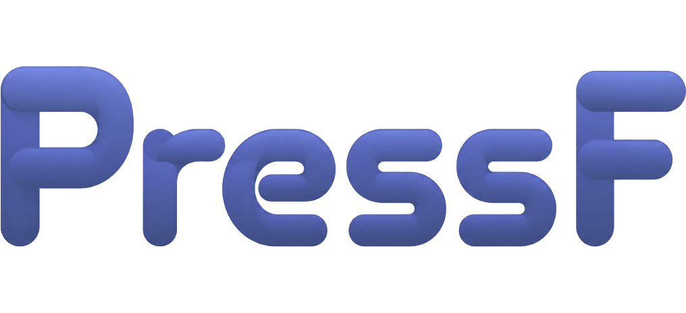

<p align="center">
  
</p>

<h3 align="center">Verify every AI answer before it reaches your customers, team, or product.</h3>

PressF is a Python CLI and macOS desktop workbench for evaluating RAG systems and LLM assistants. It checks answers against your documents, drafts evidence-backed verdicts, and leaves the final label to a human. The result is a human-verified goldset, not an unreviewed LLM score.

> **Beta** — PressF is under active development. Workflows and report formats may change; validate results before using them in production.

The design priority is simple: automate the repetitive investigation, not the decision. The judge finds relevant evidence, quotes it, and explains its verdict; the reviewer confirms, rejects, or skips it. Projects stay as ordinary files: `lazy.yaml`, JSONL examples, verdicts, annotations, and exported reports.


## Quick start

Requires Python 3.11+ and an Anthropic API key for the default judge.

```bash
uv venv
uv pip install --python .venv/bin/python -e '.[dev]'
export ANTHROPIC_API_KEY=sk-ant-...

# Estimate first; this does not send a judge request.
.venv/bin/lazy check demo-project --dry-run

# Write evidence-backed verdicts to demo-project/data/verdicts.jsonl.
.venv/bin/lazy check demo-project

# Review them in the terminal. p = pass, f = fail, s = skip.
.venv/bin/lazy review demo-project

# Write out/goldset.jsonl and out/report.md.
.venv/bin/lazy export demo-project
```

The included demo uses `docs_folder` retrieval over [`demo/kb`](demo/kb) and eight deliberately mixed answers from [`demo/qa.jsonl`](demo/qa.jsonl). The exported goldset includes labels, verdict categories, confidence, evidence, reviewer agreement, and a hash of the guidelines used for the run. `check` is idempotent; `review` resumes from the first unanswered card.

## What PressF evaluates

- **Truth Check** — find answers that contradict or invent facts relative to the knowledge base.
- **Policy Check** — find answers that break a supplied rule or policy.
- **Search Quality** — judge the context returned by *your* retrieval system. Every row needs its logged retrieved context; PressF deliberately does not substitute its own search.
- **Compare Versions** — compare a baseline and new answer on the same question. Human review is blind to side identity; the report gives a win rate, a 95% interval, an exact sign test, and a release recommendation.
- **Agent Trajectory** — evaluate recorded tool use, execution order, safety, evidence grounding, and the final answer.

## Create a project from your data

`init` creates the project, validates the input, writes `GUIDELINES.md`, health-checks the retriever, and saves the configuration.

```bash
.venv/bin/lazy init support-audit \
  --data ./answers.jsonl \
  --question-col question \
  --answer-col answer \
  --retriever docs_folder \
  --kb ./docs
```

Input can be JSONL, CSV, TSV, or XLSX (`pressf[xlsx]` installs the Excel reader). PressF saves the selected column mapping in `lazy.yaml`, so incremental imports use the same schema. For a guided setup, use `.venv/bin/lazy init support-audit --chat`; it requires `ANTHROPIC_API_KEY`.

### Search Quality

Map the context returned by the system under test when creating the project:

```bash
.venv/bin/lazy init search-audit \
  --data ./traces.jsonl \
  --question-col question \
  --answer-col answer \
  --context-col retrieved_context \
  --retriever docs_folder \
  --kb ./docs \
  --yes

.venv/bin/lazy check search-audit --task retrieval_quality
```

The context cell can be plain text, a JSON array of strings, or a JSON array of `{ "text", "source" }` chunks. Without it, the result would describe PressF's search rather than your retrieval system.

### Agent Trajectory

Agent Trajectory evaluates the execution path rather than only the final answer. It accepts native PressF trajectories, LangSmith runs, Langfuse observations, and OpenAI Chat Completions message logs. This mode has no retriever requirement:

```bash
.venv/bin/lazy init agent-audit --data ./traces.jsonl --task agent_trajectory --yes
.venv/bin/lazy check agent-audit --limit 5 --sync
.venv/bin/lazy review agent-audit
.venv/bin/lazy export agent-audit
```

See [Agent Trajectory](docs/agent-trajectory.md) for the trace schema, verdict categories, report contents, and a runnable demo.

## Desktop app

The Electron app is a graphical layer over the same local projects and CLI. Run it from the repository root after creating the Python environment:

```bash
cd app
npm install
npm run dev
```

The desktop process looks for `../.venv/bin/lazy`; without that environment it falls back to a `lazy` executable on `PATH`.

## Documentation

- [CLI projects, review, export, and regression gates](docs/cli.md)
- [Agent Trajectory: supported traces, setup, categories, and reports](docs/agent-trajectory.md)
- [Desktop app: test, build, and package](docs/desktop.md)
- [Retrievers and judge providers](docs/retrievers.md)
- [Desktop release and signing notes](app/RELEASE.md)
- [In-app help](app/DOCS.md)

## Test the repository

```bash
.venv/bin/python -m pytest
cd app && npm test
```

Python tests cover the CLI, ingest, judging, retrieval adapters, export, and scoring. The desktop suite covers its project-data layer, trace ingestion, scanner logic, strings, and shared statistics.

## License

[MIT](LICENSE)
