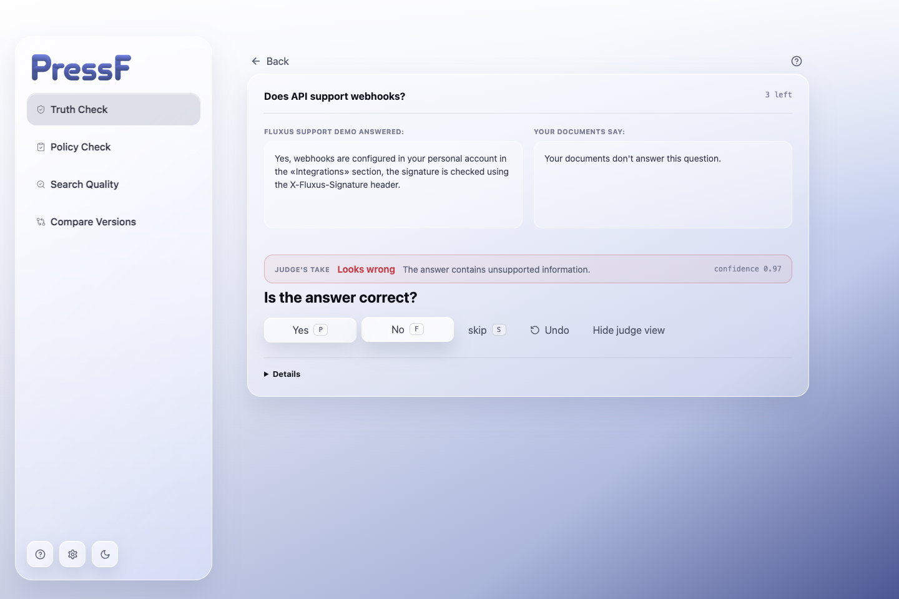

<p align="center">
  
</p>

PressF is a Python CLI and macOS desktop workbench for evaluating RAG systems and LLM assistants. It checks answers against your documents, drafts evidence-backed verdicts, and leaves the final label to a human. The result is a human-verified goldset, not an unreviewed LLM score.

The design priority is simple: automate the repetitive investigation, not the decision. The judge finds relevant evidence, quotes it, and explains its verdict; the reviewer confirms, rejects, or skips it. PressF then measures whether the judge has earned enough agreement to be useful for triage.

Projects stay as ordinary files: `lazy.yaml`, JSONL examples, verdicts, annotations, and exported reports. The desktop app uses the same CLI semantics rather than a separate evaluation format.



## Quick start: check the included RAG examples

Requires Python 3.11+ and an Anthropic API key for the default judge.

```bash
uv venv
uv pip install --python .venv/bin/python -e '.[dev]'
export ANTHROPIC_API_KEY=sk-ant-...

# Estimate first; this does not send a judge request.
.venv/bin/lazy check demo-project --dry-run

# Write evidence-backed verdicts to demo-project/data/verdicts.jsonl.
.venv/bin/lazy check demo-project

# Review them in the terminal. p = pass, f = fail, s = skip.
.venv/bin/lazy review demo-project

# Write out/goldset.jsonl and out/report.md.
.venv/bin/lazy export demo-project
```

`check` is idempotent: a later run only evaluates examples without verdicts unless you pass `--force`. `review` resumes from the first unanswered card, so the session can be stopped safely.

The demo uses `docs_folder` retrieval over [`demo/kb`](demo/kb) and eight deliberately mixed answers from [`demo/qa.jsonl`](demo/qa.jsonl). The exported goldset includes labels, verdict categories, confidence, evidence, reviewer agreement, and a hash of the guidelines used for the run.

## What PressF evaluates

The desktop app exposes four evaluation modes.

- **Truth Check** — find answers that contradict or invent facts relative to the knowledge base.
- **Policy Check** — find answers that break a supplied rule or policy.
- **Search Quality** — judge the context returned by *your* retrieval system. Every row must contain its logged retrieved context; PressF deliberately refuses to substitute its own search.
- **Compare Versions** — compare a baseline and new answer on the same question. Human review is blind to side identity; the report gives B's win rate, a Wilson 95% interval, an exact sign test, and a release recommendation.

For Compare Versions, the existing pairwise judge can prioritize uncertain pairs and later report agreement with the human reviewer. It does not replace the human pairwise decision.

## Create a project from your data

`init` creates the project, validates the input, writes `GUIDELINES.md`, health-checks the retriever, and saves the configuration.

```bash
.venv/bin/lazy init support-audit \
  --data ./answers.jsonl \
  --question-col question \
  --answer-col answer \
  --retriever docs_folder \
  --kb ./docs
```

Interactive setup is the default. For a guided setup that inspects the local project and asks about the use case, run:

```bash
.venv/bin/lazy init support-audit --chat
```

`--chat` requires `ANTHROPIC_API_KEY`. For scripts, provide all required flags and add `--yes` to skip prompts.

Input can be JSONL, CSV, TSV, or XLSX (`pressf[xlsx]` installs the Excel reader). PressF stores the selected column mapping in `lazy.yaml`, so incremental imports use the same schema. Both `lazy` and `pressf` invoke the same CLI.

### Search Quality input

Search Quality measures retrieval, not PressF's BM25 fallback. Include the retrieved chunks from the system being evaluated and map that column at project creation:

```bash
.venv/bin/lazy init search-audit \
  --data ./traces.jsonl \
  --question-col question \
  --answer-col answer \
  --context-col retrieved_context \
  --retriever docs_folder \
  --kb ./docs \
  --yes

.venv/bin/lazy check search-audit --task retrieval_quality
```

The context cell can be plain text, a JSON array of strings, or a JSON array of `{ "text", "source" }` chunks. A missing context is an error, because otherwise the result would describe PressF's search rather than yours.

### Policy Check

Use the same project structure, point the retriever at the policy documents, then select the task for the check:

```bash
.venv/bin/lazy check support-audit --task policy_compliance
```

The policy judge returns either compliance, a violation with the offending sentence and quoted rule, or an unclear-policy result.

## Review, calibrate, export

```bash
# Cheap smoke run before a large corpus.
.venv/bin/lazy check support-audit --limit 5 --sync

# Review low-confidence or decision-boundary examples first.
.venv/bin/lazy review support-audit --order informative --annotator alice

# Re-show a sample without the judge verdict to measure self-consistency.
.venv/bin/lazy review support-audit --self-check

# Inspect human/judge disagreements, then propose a GUIDELINES.md update.
.venv/bin/lazy calibrate support-audit

# Export JSONL by default; CSV and Hugging Face Dataset are optional formats.
.venv/bin/lazy export support-audit --formats jsonl,csv,hf
```

`calibrate` never silently edits the project: it proposes a marked section for `GUIDELINES.md`, shows it, and asks before writing it. Re-run `check --force` after accepting a proposal to measure the change.

For multiple reviewers, pass `--annotator`. The report calculates pairwise Cohen's kappa when reviewers labeled overlapping examples.

## Regression gate

Use a reviewed goldset to block a regression in CI. The gate uses human labels when present and falls back to judge verdicts only when no human labels exist.

```bash
.venv/bin/lazy gate support-audit --min-faithfulness 0.85
```

Exit code `0` means the threshold passed, `1` means it failed, and `2` means there is nothing to score. A small GitHub Actions step looks like this:

```yaml
- run: |
    .venv/bin/lazy check support-audit --sample 200 --seed 0
    .venv/bin/lazy gate support-audit --min-faithfulness 0.85
  env:
    ANTHROPIC_API_KEY: ${{ secrets.ANTHROPIC_API_KEY }}
```

`--sample` is deterministic for a given seed. Use a small limit or sample first before paying for a full judge run.

## Run the desktop app

The Electron app is a graphical layer over the same local projects and CLI. It supports the four modes, blind pairwise comparison, import, review, calibration, exports, and project settings.

```bash
# Run from the repository root after the Python environment above is installed.
cd app
npm install
npm run dev
```

The desktop process looks for `../.venv/bin/lazy`; without that environment it falls back to a `lazy` executable on `PATH`.

Build and test the app from `app/`:

```bash
npm test
npm run build
npm run dist   # macOS arm64 DMG
```

Packaging and signing details are in [app/RELEASE.md](app/RELEASE.md). The in-app help is also available as [app/DOCS.md](app/DOCS.md).

## Retrievers and judge providers

The built-in `docs_folder` and `chunks_file` retrievers use BM25 and need no embedding model. The project also has lazy-loaded adapters for Chroma, FAISS, Qdrant, pgvector, Pinecone, Weaviate, Milvus, Elastic/OpenSearch, and LanceDB.

Install an adapter only when you use it:

```bash
uv pip install --python .venv/bin/python -e '.[qdrant]'
# or: .[chroma], .[faiss], .[pgvector], .[pinecone], .[weaviate],
#     .[milvus], .[elastic], .[lancedb]
```

Vector-backed retrievers need an `embeddings:` section configured with the model used to build the index. `init` performs a retriever health check and sample search before it saves the project.

Anthropic is the default judge provider. OpenAI and OpenAI-compatible endpoints are supported through `lazy.yaml` or setup flags; the latter requires both a model name and `base_url`. Anthropic Batch API is used only for the standard Truth Check path when the corpus meets `batch_min_examples`; other tasks run synchronously.

## Useful commands

```bash
lazy check PROJECT --dry-run              # estimate cost without judging
lazy check PROJECT --force                # rejudge existing verdicts
lazy check PROJECT --sample 200 --seed 0  # deterministic sample
lazy add PROJECT --data fresh.jsonl       # append deduplicated examples
lazy run PROJECT --command "python bot.py {question}"
lazy export PROJECT --pairs               # pairwise/DPO-oriented export
lazy export PROJECT --disagreements       # only human/judge disagreements
```

`lazy run` invokes the system under test through a command or HTTP configuration and writes fresh `{id, question, answer}` rows. It is the bridge between a stable goldset and a changed bot version.

## Test the repository

```bash
.venv/bin/python -m pytest
cd app && npm test
```

Python tests cover the CLI, ingest, judging, retrieval adapters, export, and scoring behavior. The desktop test suite covers its project-data layer, trace ingestion, scanner logic, strings, and shared statistics.

## License

[MIT](LICENSE)
